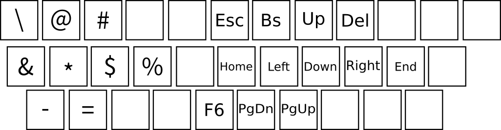

### My dotfiles 
This repository is for preserving my dotfiles and syncing with other linux machines.

Mostly it is fine to just save my dotfiles to my vps git server, but who knows what would happen to vps provider (while github is also not 100% safe from any undesirable consequences though).

Most of the config files are common things or easy to find. So with readme I'll just describe only about my xmodmap file.

### Xmodmap

* Keycodes (Every key represents output of **[Mod key + keycode]** )
	- 'Left\_Alt' : Mod\_key
	- 'Caps\_Lock' : Left\_Alt
	- 'Q' : \
	- 'w' : @
	- 'e' : #
	- 'a' : &
	- 's' : *
	- 'd' : $
	- 'f' : %
	- 'z' : - (Dash)
	- 'x' : =
	- 'y' : \<Esc>
	- 'u' : \<BackSpace>
	- 'i' : \<Up>
	- 'o' : \<Del>
	- 'h' : \<Home>
	- 'j' : \<Left>
	- 'k' : \<Down>
	- 'l' : \<Right>
	- ';' : \<End>
	- 'b' : \<F6>
	- 'n' : \<PageUp>
	- 'm' : \<PageDown>

* Reasonings
	- **Q** for **escape character(\\)** which is quite useuful when you use default leader key for vim. Also easy to type LaTex commands. Much easier to press rather than e key so yes, why not q.
	- **W** and **E** Respectively for **at(@)** and **number sign(#)**. No need for shift but only alt keys. Easy css query selector, javadoc documentation... ETC.
	- **A** for **ampersand(&)**. A key because it is called ampersand. No need to even look for keyboard when you have to type reference arguments or parameters.
	- **S** for **star(*)** or asterisk. Easy deref here we go.
	- **D** for **dollar sign($)**. Easy jqeury and bash scripting.
	- **f** for **percent(%)**. Latin speakers might not know but in Korean F and P are pronounced similarly so technically I chose f for fercent.
	- **z** for **dash(-)**. These days many languages return with '->' and I can't one hit '-' for reason that I don't know.
	- **x** for **equal(=)**. Hardly any real reasons since I have no difficulties typing '='. But why not.
	- **Y** for **Escape Key\<Esc>**. Mostly for vim, this keymapping uses 'i j k l' for arrow keys so that I cannot use alt + l for esc.
	- **U** and **O** for **BackSpace Key** and **Delete Key** respectively. It's really handy to delete wrong typed characters while keeping your hand position.
	- **I**, **J**, **K** and **L** for **Arrow Up**, **Arrow Left**, **Arrow Down**, and **Arrow Right** respectively. I often use 'h,j,k,l' if vim keybinding is available but I also prefer using [ mod key + i, j, k, l ] for navigation since I can navigate without going to normal mode.
	- **H** and **;** for **Home** and **End**. Actually this home and end keyampping was the reason why I started to make my own keymapping. Dollar sign and 0 key for end and home? Hell no for me.
	- **N** and **M** for **PageUp** and **PageDown** respectively. Convenient when program doesn't support vim keybindings and you don't like moving your hands.
	- **B** for **F6**. This is for focusing address bar on firefox. I use userChrome.css to hide address bar and I don't like typing ctrl+l and it is also not a toggle but trigger key. So I have to press F6 anyway to disable addressbar which sucks.
